<h1 align="center">
  <br>
  Plants VS Zombies Desktop
  <br>
  <a href="https://github.com/xotaym/pvz-desktop/releases/latest">
    
  </a>
  
  

  <span>⭐Don't forget to give it a star!⭐</span>
  
  <span>⭐Не забудьте поставить звездочку!⭐</span>
  <br>
  Russia 
  <br>
</h1>


<p align="center">
  <b>Твой рабочий стол — поле битвы.</b>
  <br>
  <sub>Фанатский PvZ, где зомби вторгаются на твой настоящий рабочий стол Windows.</sub>
</p>

<p align="center">
  
  
  
</p>

<br>

<p align="center"><i>
  Ты запускаешь игру. Появляется твой настоящий рабочий стол. Windows Defender предупреждает о критической угрозе.
  <br>
  Иконки начинают исчезать. Экран трескается. За трещинами — лужайка PvZ.
  <br>
  Битва начинается.
</i></p>

<br>

---

<br>

<h2 align="center">Растения</h2>

<table align="center">
<tr>
<td align="center" width="120"><br><b>Подсолнух</b><br><sub>50 солнц</sub></td>
<td align="center" width="120">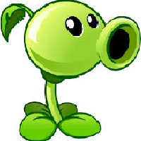<br><b>Горохострел</b><br><sub>75 солнц</sub></td>
<td align="center" width="120">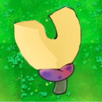<br><b>Папка-магнит</b><br><sub>75 солнц</sub></td>
<td align="center" width="120"><br><b>Сиамский</b><br><sub>125 солнц</sub></td>
<td align="center" width="120">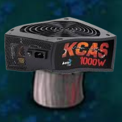<br><b>КСАС-гриб</b><br><sub>150 солнц</sub></td>
<td align="center" width="120"><br><b>Солнце-гриб</b><br><sub>25 солнц</sub></td>
<td align="center" width="120">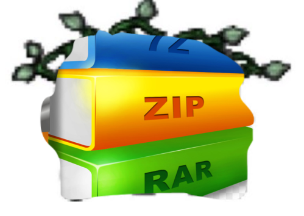<br><b>Разархиватор</b><br><sub>50 солнц</sub></td>
<td align="center" width="120">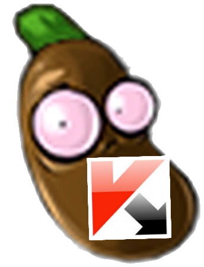<br><b>Касперский-боб</b><br><sub>50 солнц</sub></td>
<td align="center" width="120"><br><b>Ромашка</b><br><sub>75 солнц</sub></td>
<td align="center" width="120">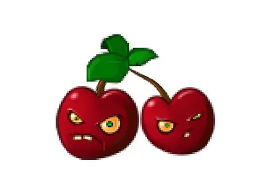<br><b>Вишня</b><br><sub>80 солнц</sub></td>
</tr>
<tr>
<td align="center"><sub>Генерирует солнца каждые несколько секунд</sub></td>
<td align="center"><sub>Стреляет горошинами по зомби</sub></td>
<td align="center"><sub>Вытягивает системные файлы у зомби</sub></td>
<td align="center"><sub>Стреляет в обе стороны</sub></td>
<td align="center"><sub>Взрывает область 5x5, оставляет глитчи</sub></td>
<td align="center"><sub>Подсолнух для ночного режима</sub></td>
<td align="center"><sub>Разархивирует заархивированные растения</sub></td>
<td align="center"><sub>Лечит заражённые троянами растения</sub></td>
<td align="center"><sub>Случайный дроп каждые 8-12с</sub></td>
<td align="center"><sub>3x3 взрыв, макс. 5 зомби</sub></td>
</tr>
</table>

<br>

<h2 align="center">Зомби</h2>

<table align="center">
<tr>
<td align="center" width="120">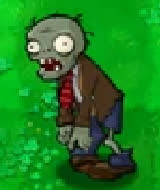<br><b>Зомби</b></td>
<td align="center" width="120">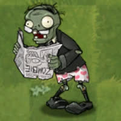<br><b>Систем</b></td>
<td align="center" width="120">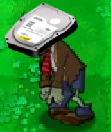<br><b>HDD</b></td>
<td align="center" width="120">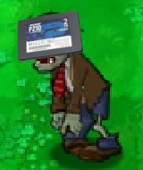<br><b>SSD</b></td>
<td align="center" width="120">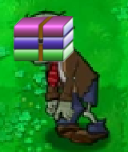<br><b>WinRAR</b></td>
<td align="center" width="120">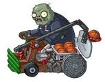<br><b>Троян-катапульта</b></td>
<td align="center" width="120">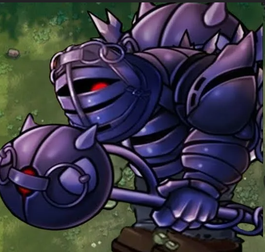<br><b>Ваша Смерть</b></td>
</tr>
<tr>
<td align="center"><sub>Обычный. Каждый следующий — «копия» файла.</sub></td>
<td align="center"><sub>Несёт системный файл. Повредишь его - смерть.</sub></td>
<td align="center"><sub>Медленный, но крепкий. HDD ломается после 3 попаданий.</sub></td>
<td align="center"><sub>Быстрый, но хрупкий. SSD ломается после 2 попаданий.</sub></td>
<td align="center"><sub>Архивирует растения. Используй разархиватор!</sub></td>
<td align="center"><sub>Стреляет троянами. Заражает растения!</sub></td>
<td align="center"><sub>???</sub></td>
</tr>
</table>

<br>

---

<br>

<h2 align="center">Фишки</h2>

<p align="center">

**Твой настоящий рабочий стол** — обои, иконки, всё как есть
<br>
**Курсик** — твой лучший друг в игре, управляет всеми зомби
<br>
**Ночной режим** — тёмная лужайка, солнце-грибы вместо подсолнухов
<br>
**BSOD-смерти** — у каждой смерти уникальная причина и совет
<br>
**Панель разработчика** — консольные команды, спавн зомби, выдача солнц

</p>

<br>

---

<br>

<h2 align="center">Установка и запуск</h2>

<p align="center">
  <b>Windows 10/11 &nbsp;|&nbsp; Python 3.10+</b>
</p>

```
git clone https://github.com/Xotaym/pvz-desktop.git
cd pvz-desktop
pip install -r requirements.txt
python server.py
```

<p align="center">
  Или просто запусти <code>start.bat</code> — он установит всё сам и запустит игру.
</p>

<br>

> **Хочешь .exe без Python?**
> Запусти `build.bat` — он соберёт портативную версию через PyInstaller.

<br>

---

<br>

<h2 align="center">Управление</h2>

<p align="center">

| | |
|:---:|---|
| **ЛКМ** | Выбрать растение, посадить, собрать солнце |
| **ПКМ** | Убрать посаженное растение |
| **ESC** | Меню паузы |
| **`** | Панель разработчика (если включена в настройках) |

</p>

<br>

---

<br>

<h1 align="center">English </h2>

A fan-made Plants vs Zombies made by Russian developer where the game is played **on your real Windows desktop**.

**Features:** 10 plants, 7 zombies (including a boss), trojan infection mechanic, night mode, BSOD death screens, dev panel with console.

**Quick start:**
```
git clone https://github.com/Xotaym/pvz-desktop.git
cd pvz-desktop
pip install -r requirements.txt
python server.py
```
Or run `start.bat`. For standalone `.exe` — run `build.bat`.

<br>

---

<p align="center">
  <sub>Сделано <b>Xotaym</b></sub>
  <br>
  <sub>Фан-проект. Plants vs Zombies — торговая марка Electronic Arts.</sub>
</p>
